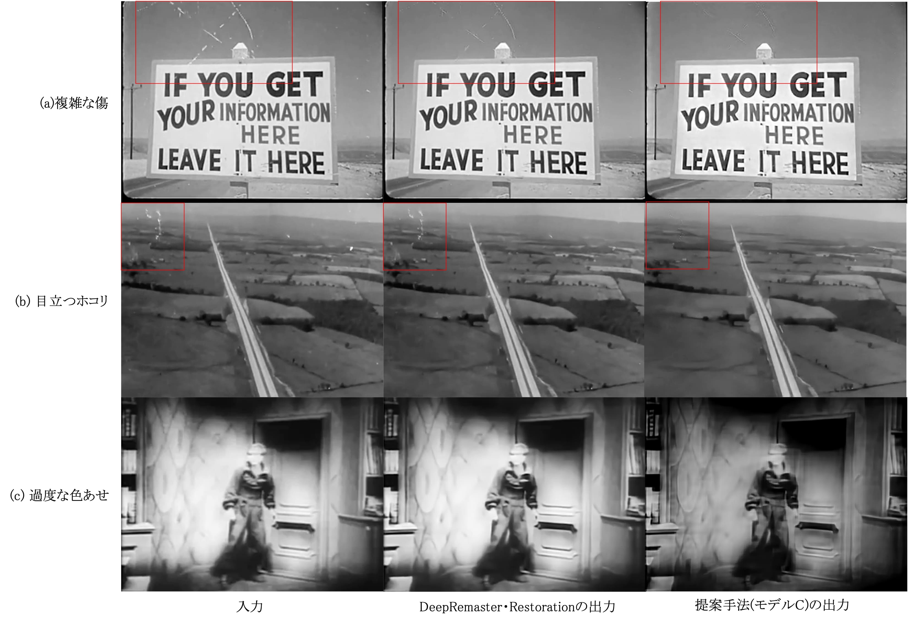

# 卒論「深層学習による劣化した古い映像のデジタル修復」のコード

ディープラーニング手法で劣化した古い映像を修復する。

## 実行方法

### 学習

```bash
$ python main.py --train --world_size <使うマシンの数> --num_gpus_per_node <1台のマシンで使用するGPUの数> --rank <番号(0から始まる)> --dist_url tcp://<0番のマシンのIPアドレス>:<空いているポート> --batch_size　<1つGPU上のバッチサイズ> --checkpoint_path <モデル保存のパス> --data_root <学習データのルートパス> --sequence_length <連続フレーム数>

# 例: 
# マシン数=2, 1台のマシンで使用するGPUの数=1, 0番のマシンIPアドレス=192.168.0.11の場合
# マシン1
$ python train.py --train --world_size 2 --num_gpus_per_node 1 --rank 0 --dist_url tcp://192.168.0.11:31478 --batch_size 1 --checkpoint_path checkpoints/checkpoint_latest.tar --data_root /path/to/videos/ --sequence_length 10
# マシン2
$ python train.py --train --world_size 2 --num_gpus_per_node 1 --rank 1 --dist_url tcp://192.168.0.11:31478 --batch_size 1 --checkpoint_path checkpoints/checkpoint_latest.tar --data_root /path/to/videos/ --sequence_length 10
```

### 推論

```bash
$ python main.py --remaster --world_size <使うマシンの数> --num_gpus_per_node <1台のマシンで使用するGPUの数> --rank <番号(0から始まる)> --dist_url tcp://<0番のマシンのIPアドレス>:<空いているポート> --batch_size　<1つGPU上のバッチサイズ> --checkpoint_path <モデル保存のパス> --data_root <入力データのルートパス> --output_dir <出力フォルダのパス>　--sequence_length <連続フレーム数>
```

## 従来手法[DeepRemaster](https://github.com/satoshiiizuka/siggraphasia2019_remastering)との結果比較



## TODO

環境構築や比較動画などの内容を追加
